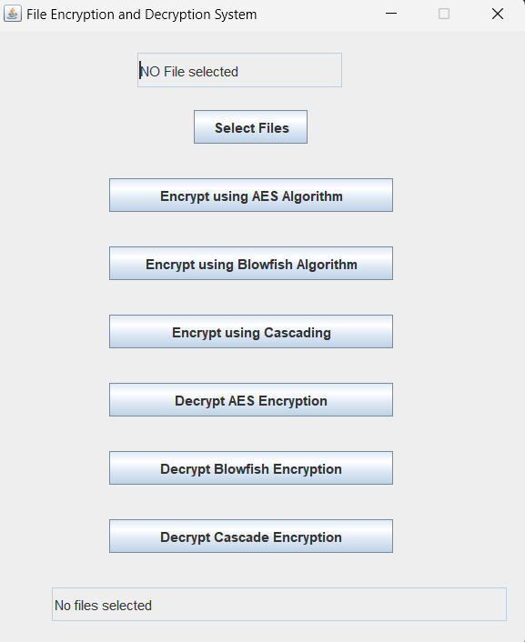

# File Encryption and Decryption Project



### Overview
This project implements file encryption and decryption using AES, BlowFish, and a cascading algorithm. It provides a secure way to protect sensitive data in files by applying strong encryption techniques.

### Features
- Supports AES encryption and decryption
- Supports BlowFish encryption and decryption
- Implements cascading algorithm for enhanced security
- Supports encryption of various file types

### Encryption Algorithms Used
1. AES (Advanced Encryption Standard)
2. BlowFish

### Cascading Algorithm
The cascading algorithm combines AES and BlowFish encryption to enhance the security of the encrypted files.

### Supported Algorithms
- AES
- BlowFish
- Cascading (Combination of AES and BlowFish)

### Installation
1. Clone this repository:
    ```bash
    https://github.com/maheshsathe07/File-Encryptor-Decryptor.git
    ```

### Contributors
- Mahesh Sathe

### License
This project is licensed under the MIT License. See the [LICENSE](LICENSE) file for details.
